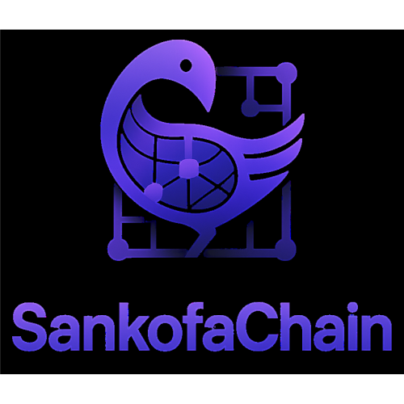

# SankofaChain Marketplace

<div align="center">
  
  
  <h3>A Revolutionary Multivendor Platform for African Commerce</h3>
  
  <p>Built on Base blockchain • Powered by ENS & EFP • Protecting African Cultural IP</p>
  
  [](https://sankofa-chain.vercel.app/)
  [](https://github.com/scaffold-eth/scaffold-eth-2)
  [](https://base.org/)
  [](https://www.typescriptlang.org/)
</div>

---

## 📌 Project / Team Name

**SankofaChain** - A Revolutionary Multivendor Platform for African Commerce
---

## 📌 Description

A decentralized multivendor marketplace built on Base blockchain connecting African creators directly with global consumers. Features NFT authenticity certificates, automated royalty distribution, and ENS-based identity verification for authentic African products and cultural experiences.

---

## 🎯 Problem, Impact & Future Roadmap

### The Problem We're Solving

African creators face significant challenges in the global marketplace:

- **IP Theft**: Traditional patterns and designs stolen without compensation ($2B+ annually)
- **Limited Market Access**: No direct path to global consumers
- **Authenticity Issues**: Consumers cannot verify genuine African products
- **Cultural Erosion**: Traditional knowledge and patterns at risk of being lost

### Our Solution

SankofaChain addresses these challenges through:

- **Blockchain-Based Authenticity**: Every product gets an NFT certificate proving authenticity
- **Automated Royalty Distribution**: Pattern creators receive compensation when their designs are used
- **Global Market Access**: Direct creator-to-consumer sales with worldwide reach
- **Cultural Preservation**: Digital archiving of traditional patterns and knowledge

### Real-World Impact

- **Creator Empowerment**: Direct income streams for African artisans
- **Cultural Preservation**: Digital archiving of traditional patterns
- **Economic Development**: New revenue streams for local communities
- **Global Reach**: International access to authentic African products

### Future Roadmap

#### Phase 1: MVP Launch (Months 1-3)
- ✅ Core marketplace functionality
- ✅ ENS integration for creator identity
- ✅ NFT-based product authentication
- ✅ Mobile-responsive design

#### Phase 2: Market Launch (Months 4-6)
- 🔄 Full payment processing with $SANKOFA token
- 🔄 IPFS integration for media storage
- 🔄 Advanced creator analytics dashboard
- 🔄 Pilot program with local cooperatives

#### Phase 3: Scale & Expansion (Months 7-12)
- 📱 Mobile application development
- 🌍 Multi-language support (French, Portuguese, Swahili)
- 🤝 Partnership integrations with cultural institutions
- 📊 Advanced analytics and creator tools

---

## 🏗️ How It's Made (Technical Breakdown)

### Tech Stack

**Frontend:**
- **Framework**: Next.js 14 with App Router
- **Language**: TypeScript
- **Styling**: Tailwind CSS with custom African pattern components
- **State Management**: Zustand for client-side state
- **Animation**: Framer Motion for smooth interactions
- **Icons**: Heroicons

**Blockchain:**
- **Network**: Base (Ethereum L2) for low-cost, fast transactions
- **Framework**: Scaffold-ETH 2 for rapid dApp development
- **Web3 SDK**: Thirdweb for marketplace functionality
- **Storage**: IPFS for decentralized file storage
- **Identity**: ENS (Ethereum Name Service) for creator verification
- **Reputation**: EFP (Ethereum Follow Protocol) for community scoring

**Smart Contracts:**
- **ERC-721**: NFTs for pattern ownership and product certificates
- **ERC-20**: $SANKOFA native utility token
- **Marketplace Logic**: Multivendor payments and commission handling
- **Royalty Distribution**: Automated creator compensation system

### System Architecture


### Key Features Implemented

1. **Multivendor Marketplace**: Individual creator stores with full product catalogs
2. **NFT Integration**: Products linked to blockchain certificates for authenticity
3. **ENS Identity System**: Creator verification using ENS domains
4. **Mobile-First Design**: Optimized for African mobile usage patterns
5. **Cultural Categories**: Kente cloth, traditional crafts, digital patterns
6. **Real-time Updates**: Live marketplace data with React Query
7. **Responsive UI**: African pattern-inspired design system

### Team Contributions

- **Boniface Delali Dakey**: Smart contract architecture, ENS integration, project leadership
- **Evans Acheampong**: Frontend development, UI/UX design, Thirdweb implementation, marketplace features
- **Samuel Adams**: Web3 integration, Filecoin, testing and debugging

---

## 📌 Public Code & Design Links (Mandatory)

### GitHub Repository
**Repository**: [https://github.com/evansachie/SankofaChain](https://github.com/evansachie/SankofaChain)

- Complete source code with commit history
- Comprehensive documentation and setup instructions
- TypeScript configuration and build scripts
- Environment setup documentation

### Build Instructions

```bash
# Clone repository
git clone https://github.com/evansachie/sankofa-chain.git
cd sankofa-chain

# Install dependencies
yarn install

# Set up environment variables
create a .env.local at the root directory with:
```
NEXT_PUBLIC_THIRDWEB_CLIENT_ID=""
NEXT_PUBLIC_MARKETPLACE_CONTRACT_ADDRESS=""
NEXT_PUBLIC_NFT_COLLECTION_CONTRACT_ADDRESS=""
NEXT_PUBLIC_BASE_SEPOLIA_RPC_URL=https://sepolia.base.org
```

# Start local blockchain
yarn chain

# Deploy contracts
yarn deploy

# Start frontend
yarn start
```

---

## 📌 Deployment & Contract Details

### Deployed Application
- **Frontend URL**: [https://sankofa-chain.vercel.app/](https://sankofa-chain.vercel.app/)
- **Network**: Base Sepolia Testnet
- **Status**: Live and functional

### Smart Contract Addresses

- Marketplace Contract: https://sepolia.basescan.org/address/0xfa0Fa57F4861A192329e279aa977d2c4fe0C2D6E

- NFT Drop Contract: https://sepolia.basescan.org/address/0x89B9EA8aCC7502B3f8E619191b27200fBC8Dc3F0

### Usage Instructions

1. **Connect Wallet**: Use MetaMask or other Web3 wallet
2. **Switch to Base Sepolia**: Add Base Sepolia testnet to your wallet
3. **Get Testnet ETH**: Use Base faucet to get testnet ETH
4. **Browse Marketplace**: Explore African products and creators
5. **Purchase Products**: Buy authentic African goods with crypto
6. **Create Listings**: List your own products as a creator

---

## 🖼️ Screenshots

### Homepage


### Marketplace


### Product Detail


### Creator Profile


### Product Comparison


### Brands


---

## 🏆 Hackathon Track Alignment

### Culture, Creativity & Community Track
- **Cultural Preservation**: Digital archiving of traditional African patterns
- **Creator Empowerment**: Direct monetization for African artisans
- **Community Building**: ENS-based identity and reputation system
- **Cultural Education**: Platform for sharing traditional knowledge

### Ethereum for Everyone Track
- **Base L2**: Low-cost, fast transactions for everyday commerce
- **Mobile-First**: Optimized for African mobile usage patterns
- **User-Friendly**: Intuitive interface for non-crypto users
- **Accessibility**: Simplified onboarding and wallet integration

### ENS Everywhere Bounty
- **Creator Identity**: `creator-name.sankofachain.eth` domains
- **Pattern Provenance**: `kente-pattern-001.creator.sankofachain.eth`
- **Brand Verification**: `brand-name.sankofachain.eth`
- **Text Records**: Creator metadata and cultural information

### EFP Challenge
- **Master Artisan Attestations**: Cultural committee verification
- **Community Reputation**: Trust scoring for marketplace participants
- **Verifiable Credentials**: Marketplace access verification
- **Social Graph**: Creator network and collaboration tracking

### Buidl Guidl Bounty
- **Scaffold-ETH 2**: Complete implementation using the framework
- **Advanced dApp**: Complex marketplace with multiple features
- **Best Practices**: Clean code, proper testing, documentation
- **Innovation**: Creative use of Web3 technologies

### Base Bounty
- **Base Network**: Built specifically for Base L2
- **Real-World Impact**: Solving actual problems in African communities
- **Onchain App**: Fully functional marketplace on Base
- **Community Focus**: Empowering local creators and artisans

---


## 🛠️ Development

### Project Structure

```
sankofachain/
├── packages/
│   ├── hardhat/                 # Smart contracts
│   │   ├── contracts/           # Solidity contracts
│   │   ├── deploy/              # Deployment scripts
│   │   └── test/                # Contract tests
│   └── nextjs/                  # Frontend application
│       ├── app/                 # Next.js app router
│       ├── components/          # React components
│       ├── hooks/               # Custom hooks
│       ├── stores/              # Zustand stores
│       └── types/               # TypeScript types
├── prd.md                      # Product requirements
```

### Available Scripts

```bash
# Development
yarn chain          # Start local blockchain
yarn deploy         # Deploy contracts
yarn start          # Start frontend
yarn build          # Build for production

# Testing
yarn test           # Run tests
yarn test:contracts # Test smart contracts

# Deployment
yarn vercel         # Deploy to Vercel
yarn ipfs           # Deploy to IPFS
```
---

<div align="center">
  <p><strong>Sankofa</strong> - "Go back and get it" - Preserving African heritage while building a better future</p>
  
  <p>Built with ❤️ for the African creator community</p>
</div>
